<div align="center">

# Basenine Feedback

**Visual feedback for client websites.**<br/>
The tool does the bookkeeping of a feedback round, so people only make the decisions.

[**Live app**](https://basenine-feedback.vercel.app) &nbsp;·&nbsp; [**Demo client site**](https://basefeed-demo.vercel.app) &nbsp;·&nbsp; [**Figma → Webflow assessment**](docs/figma-to-webflow.md)

[](https://github.com/n-3-0-l-d-3-v/basefeed/actions/workflows/ci.yml)

</div>

<p align="center">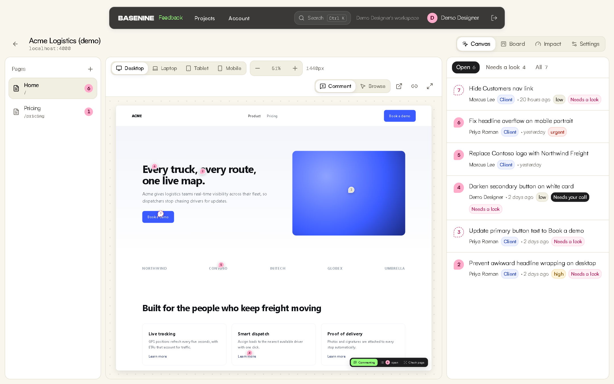</p>

A client clicks any element on the real site and types a comment. It arrives pinned to that element,
with a screenshot, the Webflow classes, the device and the browser already attached. From there the
tool labels it, flags what needs a decision, notices when it has been fixed, and asks the client to
confirm, without anyone chasing anyone.

| Start here | How it works | Use it |
|---|---|---|
| [In one minute](#in-one-minute)<br/>[Why it exists](#why-it-exists)<br/>[A feedback round, step by step](#a-feedback-round-step-by-step)<br/>[What is automated](#what-is-automated) | [Architecture](#architecture)<br/>[Security](#security)<br/>[Guarantees](#guarantees-measured-not-claimed)<br/>[Integrations](#integrations)<br/>[Figma → Webflow](#figma--webflow-proof-of-concept) | [Try the live demo](#try-the-live-demo)<br/>[Run locally](#run-locally)<br/>[Install on a Webflow site](#install-on-a-webflow-site)<br/>[Tests](#tests) · [Deploy](#deploy)<br/>[What it needs to go live](#what-it-needs-to-go-live-at-a-studio)<br/>[Known limits](#known-limits) |

> Every screenshot on this page is taken by a script from the running app with the demo data and the
> real AI provider ([`apps/web/screens`](apps/web/screens)); none is a mock-up. Rebuild them with `pnpm --filter web screens`.

---

## In one minute

- **What it is.** A feedback tool for a Webflow studio: clients comment on the real site, the team works from a canvas and a board, and the tool does the bookkeeping in between.
- **What changed from Feedback 2.0.** No proxy (so Cloudflare-protected sites work), comments that stay on their element when the page is edited, and client sites that stay on their own origin.
- **What it automates.** Capturing context, labelling and sorting, assigning, noticing fixes, asking the client to confirm, reminding them, and telling Slack or n8n. People only decide.
- **How far it is trusted.** 195 automated tests run on every push, including thousands of random page edits against the pinning engine. What has not been verified on real client work is listed under [Known limits](#known-limits), not hidden.

## Why it exists

It is a rebuild of an existing internal tool ("Feedback 2.0"). Three of that tool's problems were
structural, so they were fixed by changing the design rather than patching:

| Problem in 2.0 | Root cause | What this does instead |
|---|---|---|
| Sites behind Cloudflare load blank | The server fetches the site through a proxy and gets the bot-check page | One line of script on the real site. Nothing is proxied, so nothing is blocked. Works on `*.webflow.io` staging too |
| Comments drift onto the wrong element after edits or on mobile | Pins stored as "element number N" plus page-level x/y percentages | Multi-signal anchoring (content, structure, surrounding text, siblings). It finds the same element or says it cannot. It never guesses |
| The previewed site runs with the app's own permissions | Proxied HTML is served from the app's origin | Client sites stay on their own origin. The dashboard and the widget talk only through origin-checked messages |

Everything else is automation layered on top.

## A feedback round, step by step

A round has three stages. In the diagrams, the tool does every rectangular step by itself; the
diamonds are the only places a person decides.

### 1. Capture

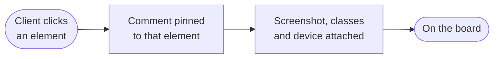

<p align="center">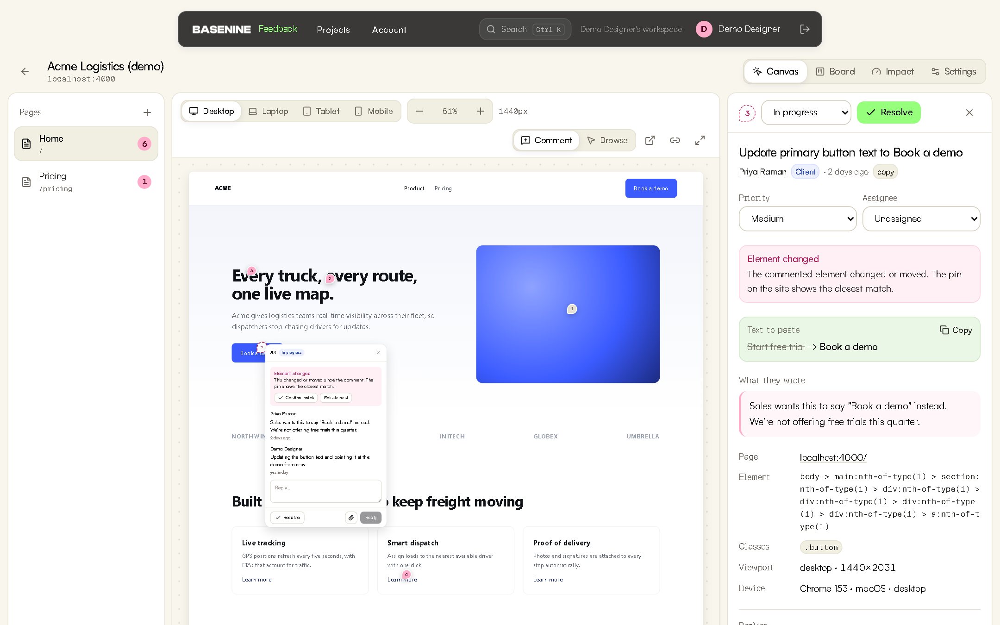</p>

*A client asked for a button to say "Book a demo". The element, its classes, the viewport and the
device were captured with the comment; the replacement text was pulled out, ready to paste.*

- **Auto-context.** Every comment carries a screenshot of the area, the element's selector and Webflow classes, breakpoint, viewport, browser and OS. Nobody asks "which page, on what device?".
- **No account for clients.** A share link asks for a name and an email. Links are scoped to one site and revocable.
- **Attachments** (choose or paste) from the site widget and the dashboard, **Loom** links played inline, comments on uploaded **design images**.

### 2. Sort


<p align="center">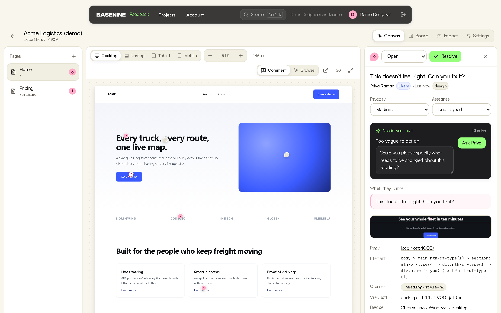</p>

*"This doesn't feel right. Can you fix it?" cannot be acted on. The AI says so, drafts the question,
and one click sends it to the client. On a clear comment there is no AI card at all.*

- **AI triage that stays quiet.** A clear comment gets a short title and a category, nothing more. It speaks up only for: a comment too vague to act on (the AI drafts the clarifying question; the team member can edit it, and one click sends it to the author), a duplicate of an older comment, a priority that is clearly wrong, and requests that are new work rather than a tweak. When the author dictates wording ("should say Book a demo") the exact replacement is extracted, ready to paste.
- **Assignment rules.** Per project: copy goes to the writer, bugs to the developer. The rule applies the moment a comment is labelled (by triage, the page check or a person), is recorded in the comment's history as a rule, and only ever fills an empty assignee.
- **Page check.** One click inspects the live page for dead links, missing alt text, empty or out-of-order headings, duplicate IDs, placeholder text, broken images, horizontal overflow and low contrast, and files each finding as a comment pinned to the element. Plain DOM inspection: no AI, same page in, same findings out.

<p align="center">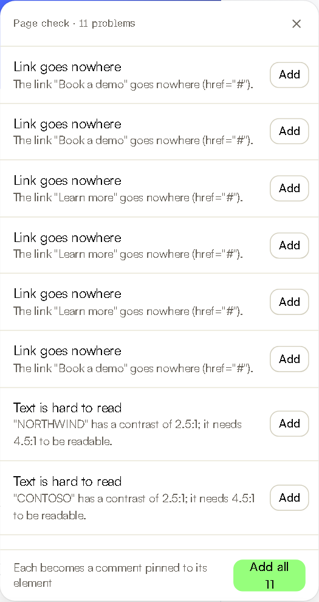</p>

### 3. Close

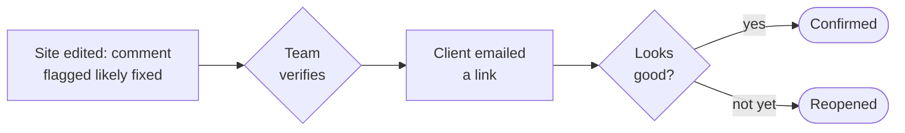

<p align="center">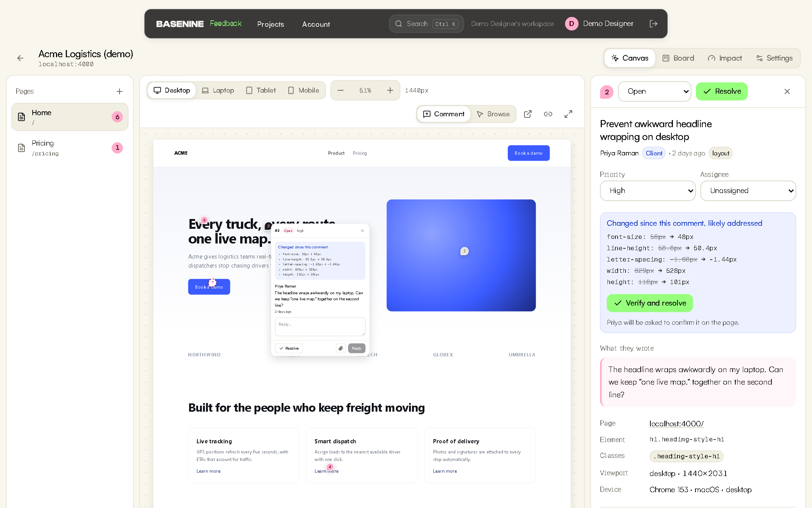</p>

*The site was edited after the comment. The tool shows what changed on that element and offers to
verify, instead of someone re-reading every open comment against the new page.*

- **Change detection.** When a commented element changes ("font-size 56px → 48px"), the comment is flagged as likely fixed. When the element is edited beyond recognition or removed, the comment says so, and a team member can re-pin it.
- **Client sign-off.** Resolving a client's comment emails them a link that opens the page on that comment, signed in, with *Looks good* / *Not yet*. "Not yet" reopens it with their note. A client who has not answered after three days (the project chooses how many, or never) gets one reminder covering everything of theirs that is waiting; it is recorded in each comment's history and never repeated.

<p align="center">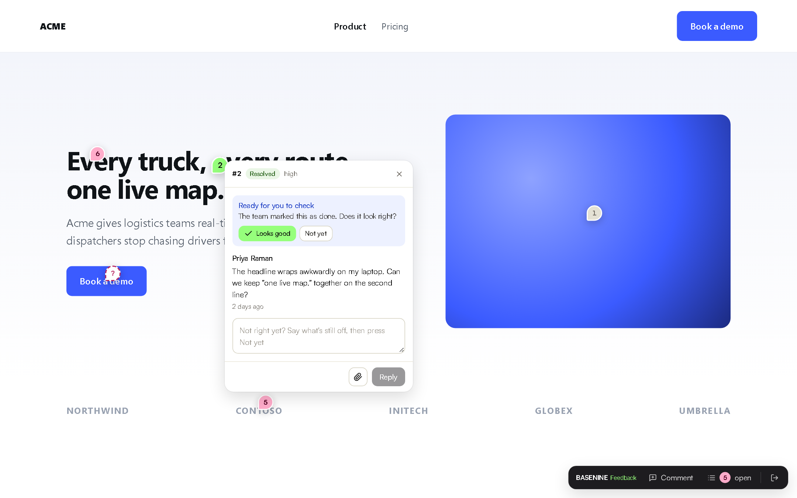</p>

*The client's side: their own site, their comment, two buttons. No account, no dashboard to learn.*

- **Client status page.** Every email to a client carries one link to a read-only page listing each comment they left and where it stands: waiting for them, being worked on, not started, done. No account. The team can copy the same link from any client comment.

<p align="center">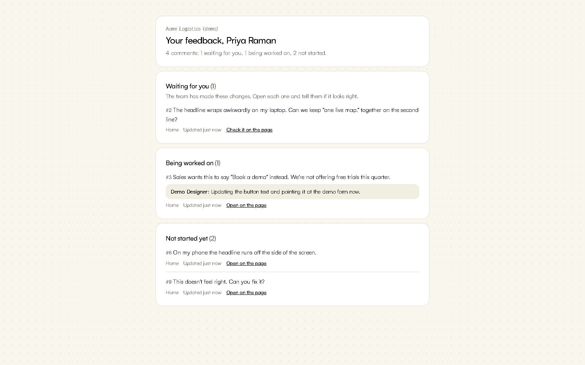</p>

### Running the project

<p align="center">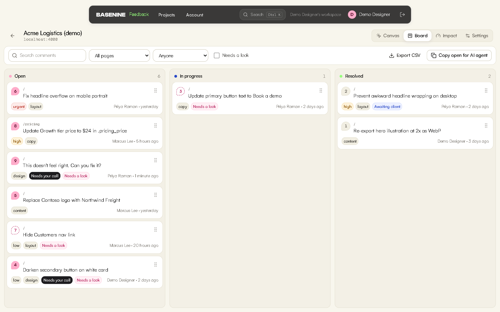</p>

- **Work surfaces:** Canvas (the live site at real device widths), Board (drag between Open / In progress / Resolved, select several cards to move or assign together, export everything as CSV), Ctrl+K search, team invites.
- **Email:** new comments, assignments and replies, each switchable per person. New comments can arrive as one digest a day, at 09:00 in that person's own time zone, instead of one email each. A weekly summary on Monday morning, for whoever runs the account, gives each project's numbers: what came in, what was closed, what is open, what is waiting on the client.
- **Connections:** outgoing webhooks (Slack, n8n, Zapier), a REST API and an MCP server for coding agents. See [Integrations](#integrations).
- **Impact.** Each project counts what the tool handled: context captured, comments sorted and flagged, fixes noticed, sign-offs, time to resolve. It also shows where a comment's time goes (waiting to be picked up, being worked on, waiting for the client's answer) as medians read from the history. Counted from the data, never estimated.

<p align="center">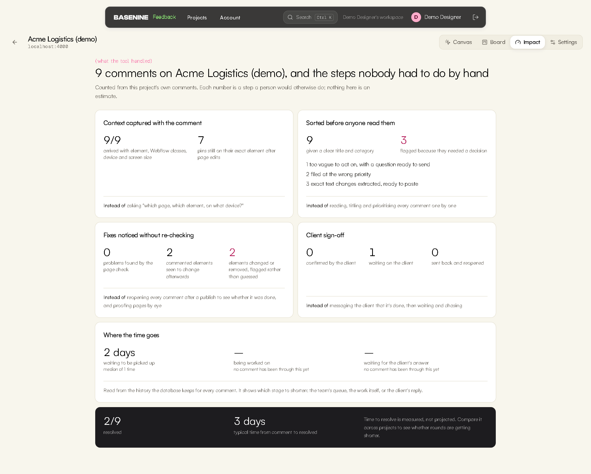</p>

## What is automated

Each row is a step somebody does by hand in a feedback round run over email, chat or a tool that only stores comments.

| Step | Done by | How |
|---|---|---|
| Recording which page, element, device and browser | The widget | Captured with the click, with a screenshot |
| Giving the comment a title and a category | AI triage | Applied silently; a person can change it |
| Spotting vague comments, duplicates, wrong priorities and new work | AI triage | Flagged for a person; nothing is sent or changed without a click |
| Pulling out the exact new wording | AI triage | Shown as "from → to", ready to paste |
| Giving it to the right person | Assignment rules | By category, the moment it is labelled; recorded as a rule |
| Finding dead links, missing alt text, overflow, low contrast | Page check | Plain inspection of the live page, filed as pinned comments |
| Noticing that a commented element was changed or removed | Change detection | Compared with what the element looked like when the comment was made |
| Asking the client whether the fix is right | Database trigger + email | Sent when a client's comment is resolved, with a signed link |
| Reminding a client who has not answered | Daily job | Once, after the number of days the project chose, one email for everything waiting |
| Telling the client where everything stands | Client status page | One read-only link, in every email |
| Telling whoever runs the account where every project stands | Weekly summary | Monday 09:00 in their time zone, one email, only if there is something to report |
| Telling the team's other tools | Webhooks | Signed, retried, with a ready-made sentence for Slack |
| Handing a task to a coding agent | REST API, MCP server | The same hand-off text as "Copy for AI agent" |
| Keeping the record of who did what | Database triggers | Activity log written by the database, not by application code |

What stays with people: deciding what to do about a flag, verifying a fix, and the client's yes or no.

## Try the live demo

1. Open the [demo client site](https://basefeed-demo.vercel.app). It is an ordinary page: the 883-byte loader does nothing for visitors.
2. Sign up on the [live app](https://basenine-feedback.vercel.app), create a project for a site you control, and paste the one-line script from Settings into that site.
3. Open the project's Canvas, click an element, leave a comment. Then create a share link in Settings and open it in a private window to comment as a client.

The demo deployment runs on free tiers: AI triage is limited to roughly 100 comments a day, and email is only delivered to the project owner's own address until a sending domain is verified.

## Architecture

### System

Three parts: the widget on the client's site, the app, and the database.

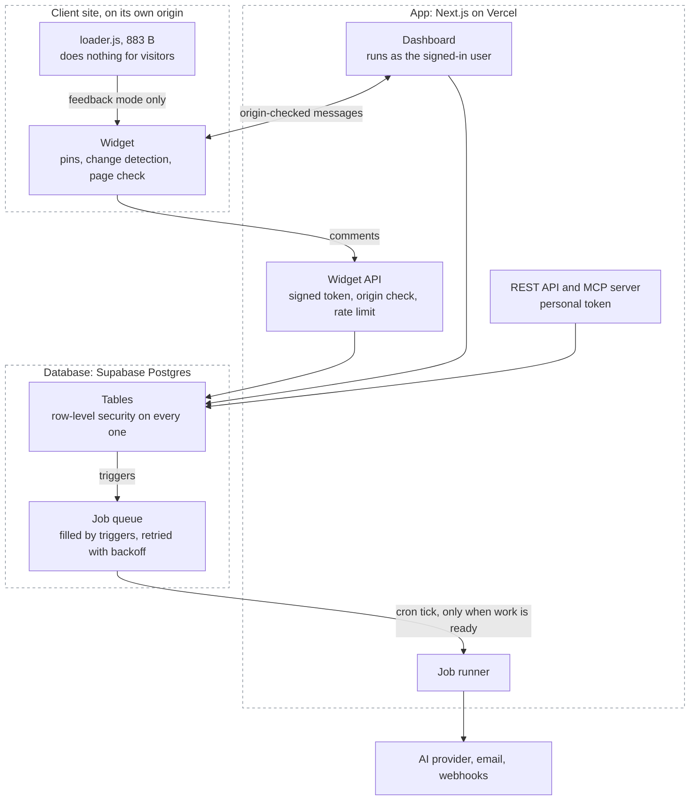

The dashboard also receives live updates from the database (Supabase Realtime), and files are kept in private storage buckets.

| Package | What it is |
|---|---|
| [`packages/anchor`](packages/anchor) | The anchoring engine and change detection. Pure TypeScript, no dependencies |
| [`packages/widget`](packages/widget) | The embed: a loader that decides whether to do anything, and the app (Preact, Shadow DOM) that loads only in feedback mode. Size-budgeted in the build |
| [`packages/shared`](packages/shared) | Zod contracts shared by widget and server; generated database types |
| [`packages/compiler`](packages/compiler) | Proof of concept for the Figma → Webflow build system |
| [`apps/web`](apps/web) | Dashboard, widget API, REST API, MCP server, job runner |
| [`supabase/`](supabase) | Schema, row-level security, triggers, job queue, pgTAP tests |
| [`e2e/site`](e2e/site) | A stand-in client site on its own origin, used by the tests and the demo |

### A comment, end to end

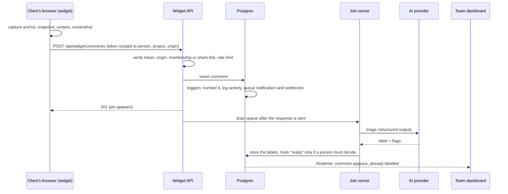

### Principles

- **AI for intent, code for execution.** AI labels a comment and flags what needs a person. Anything a client would notice (a question sent to them, a changed priority, closing a duplicate) happens only on a human's click. Anchoring, change detection, the page check, permissions and logging are deterministic code.
- **Never silently wrong.** An uncertain pin is shown as "element changed" or "removed"; it is not moved to a guess.
- **The database enforces isolation.** Row-level security on every table; the dashboard queries as the signed-in user, so an application bug cannot leak another workspace's data. Privileged paths (widget, API tokens) use the service role and scope every query to what the caller can reach; pgTAP tests assert it.
- **Nothing important depends on a code path remembering.** Numbering, the activity log, notifications, webhooks, assignment rules and the client sign-off state are database triggers.
- **Degrade, don't fail.** If the AI provider is down, out of quota or not configured, comments work exactly the same. Background work retries with backoff; a client-side upload failure never costs the client their comment.

### Data model

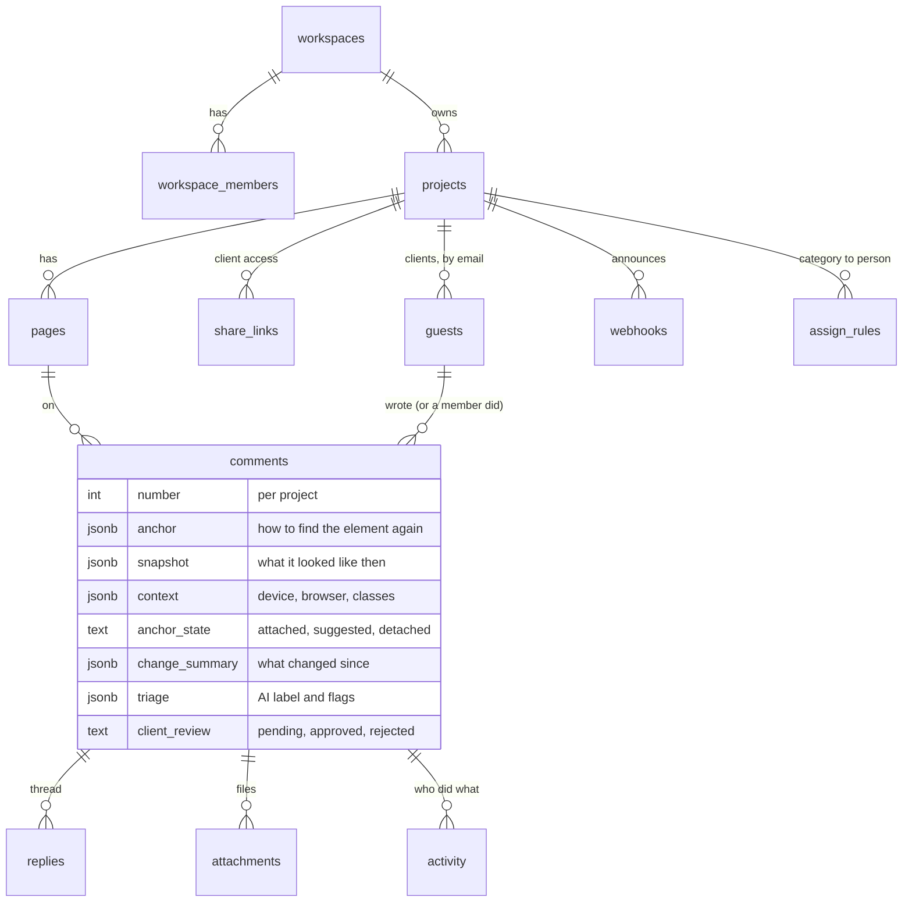

Also: `jobs` (the queue), `rate_limits`, `api_tokens` (stored as SHA-256 hashes), `workspace_invites`, `notification_prefs`, `profiles`.

### Background work

One Postgres table is the queue for AI triage, email and webhooks. Workers claim one job at a time with `FOR UPDATE SKIP LOCKED`, so a run that is cut short leaves nothing locked; a run stops starting new work after 30 seconds to stay inside the serverless time limit; failures retry up to five times with exponential backoff and jitter; a job stuck for five minutes is reclaimed. The app drains the queue right after each write. For retries, `pg_cron` ticks every minute and calls the app through `pg_net` only when a job is ready, so an idle project makes no requests. (Vercel's free plan allows only daily crons; this needs none.)

### Security

| Surface | How it is protected |
|---|---|
| Dashboard | Supabase Auth session; every query runs under row-level security |
| Widget API | JWT (HS256, 12 h) scoped to one person, one project and one origin; re-checked against the database on every request, so removing a member or switching off a share link takes effect immediately; per-person rate limit |
| Client email links | The same token, 7 days, valid only while the project still has an active share link |
| Client status page | A separate read-only token (30 days) for one client on one project; not accepted by any write endpoint; dead as soon as the share link is turned off |
| REST API and MCP | Personal tokens (`bnf_…`), stored only as a hash, revocable; every query scoped to the workspaces the owner belongs to today; per-token rate limit |
| Webhooks | HTTPS only; loopback, link-local and private addresses refused; redirects not followed; body signed with HMAC-SHA256 |
| Client sites | Stay on their own origin; the dashboard exchanges only origin-checked messages with the widget; nothing may frame the dashboard |
| Files | Private buckets, short-lived signed URLs, type and size limits enforced by storage |

## Guarantees (measured, not claimed)

Property-based tests generate thousands of random pages full of duplicates ("Learn more" ×3, shared
classes, repeated images), pin a comment, apply random edits (insert, delete, wrap, move, rename
classes, edit text, duplicate, delete the target) and check where the pin ended up.

- **A comment is only ever attached to the element it was made on, or to an exact duplicate the page gives no way to tell apart.** 3,000 random edit sequences per CI run. So far these runs have found six ways a new wrapper or a twin could be mistaken for the original; each is fixed and pinned as its own regression test. The search is random, so a seventh may exist: when a run fails, it prints the page and the edits, and `ANCHOR_REPLAY` replays them.
- Through ordinary edits elsewhere on the page:
  - distinctive content (headings, paragraphs, images): **about 90% stay attached automatically**, 99.9% attached or correctly suggested
  - repeated elements: 64% attached automatically, 98.4% attached or correctly suggested. Repeated elements inside a distinctive container (the usual card grid) are found through that container.
- Everything not attached automatically is shown as "element changed" or "removed" for a person to check.

The random pages are deliberately harsher than real sites: a tiny vocabulary with many exact duplicates.

**Not yet measured:** behaviour on a production Webflow site, and time saved on a real project. Both need a real client round.

## Integrations

### Webhooks (Slack, n8n, Zapier, Make)

Settings → Webhooks. Paste a URL, choose events, send a test.

Events: `comment.created`, `comment.status`, `reply.created`, `triage.flagged`, `client.approved`, `client.rejected`.

```json
{
  "event": "client.rejected",
  "at": "2026-10-04T09:12:44.120Z",
  "project": { "id": "…", "name": "Acme Logistics" },
  "actor": "Priya Raman",
  "comment": {
    "number": 12, "title": "Increase hero heading size on mobile", "status": "open", "priority": "high",
    "fromClient": true, "page": "https://acme.com/", "element": "h1.heading-style-h1",
    "url": "https://your-app/p/…?c=…"
  },
  "text": "Priya Raman says #12 on Acme Logistics isn't right yet: \"Increase hero heading size on mobile\"\nhttps://your-app/p/…"
}
```

- `text` is a complete sentence, which is all a Slack or Discord incoming webhook needs: paste the Slack URL and it works with no middle step.
- In **n8n**, add a *Webhook* trigger node, paste its URL here, and branch on `event`.
- Verify the sender: `X-Basenine-Signature` is `sha256=` + HMAC-SHA256 of the raw body with the webhook's signing secret.

```js
const expected = "sha256=" + crypto.createHmac("sha256", SECRET).update(rawBody).digest("hex");
const ok = crypto.timingSafeEqual(Buffer.from(expected), Buffer.from(req.headers["x-basenine-signature"]));
```

Deliveries go through the job queue: retried with backoff, last result shown in Settings. Page-check findings are not announced one by one.

### MCP server (Claude Code, Cursor, any MCP client)

```bash
claude mcp add --transport http basenine-feedback https://YOUR-APP/api/mcp --header "Authorization: Bearer bnf_…"
```

Tools: `list_feedback`, `get_feedback` (selector, Webflow classes, the request, the AI task, changes since, the thread), `reply`, `set_status`. Stateless Streamable HTTP. Tokens come from Account → API tokens.

### REST API

| Request | What it does |
|---|---|
| `GET /api/v1/feedback?status=unresolved&project=…&limit=…` | List |
| `GET /api/v1/feedback/:id` | One comment, with the same hand-off text as "Copy for AI agent" |
| `PATCH /api/v1/feedback/:id` `{"status"}` | Change status |
| `POST /api/v1/feedback/:id/replies` `{"body"}` | Reply |

REST and MCP share one service layer. Changes are logged under the token owner's name, and replies notify the people involved.

## Figma → Webflow proof of concept

[`packages/compiler`](packages/compiler) is a working core for a separate brief: converting approved Figma pages into native Webflow builds. Figma nodes → semantic description of each section (with a confidence score) → a rules engine that maps measurements to Client-First classes and tokens → a validated build plan that reuses what the site already has, is idempotent, and produces deltas.

```bash
pnpm --filter @bn/compiler demo
```

It runs on a fixture in the Figma REST API's format. It has not been run against a real Figma file or a real Webflow site. The feasibility assessment, architecture, risks and next step are in [docs/figma-to-webflow.md](docs/figma-to-webflow.md).

## Run locally

Requires Node 22, pnpm and Docker.

```bash
pnpm install
pnpm db:start                      # local Supabase (Docker)
pnpm db:reset                      # schema + demo seed (login is in supabase/seed.sql)
pnpm --filter @bn/widget build
pnpm --filter web dev              # http://localhost:3000
node e2e/site/serve.mjs            # demo client site on http://localhost:4000
```

Copy `apps/web/.env.example` to `apps/web/.env.local` and fill it from `supabase status`. AI triage is optional: `AI_PROVIDER=gemini` + `GEMINI_API_KEY` (a free key works), or `AI_PROVIDER=anthropic` + `ANTHROPIC_API_KEY`.

### Install on a Webflow site

Site settings → Custom code → Footer code:

```html
<script src="https://YOUR-APP/widget/loader.js" data-project="pk_…" defer></script>
```

Visitors are unaffected: the 883-byte loader reads two flags and exits. Feedback mode turns on from the dashboard, a client share link, or `?bn_feedback=1`.

## Tests

195 automated tests, plus type checks and lint, on every push.

| Suite | Count | Command | What it covers |
|---|---|---|---|
| Anchoring | 27 | `pnpm --filter @bn/anchor test` | Unit and property tests for the "never the wrong element" guarantee and change detection |
| Database | 96 | `pnpm db:test` | pgTAP: isolation between workspaces, forged authors, protected columns, the job ticker, client sign-off, webhook queueing, daily digests, assignment rules, client reminders, weekly summaries |
| End to end | 23 | `pnpm --filter web exec playwright test` | The real stack on two origins: commenting, device widths, edits to the page, re-pinning, the page check, assignment rules, attachments, share links, sign-off by emailed link, the client reminder, the client status page, the daily digest, invites, REST and MCP, webhooks, CSV export, editing an AI question, bulk actions on the board, the weekly summary, API security |
| Web | 26 | `pnpm --filter web test` | Triage rules, impact counts and stage timing, weekly summary numbers, webhook URL safety, CSV export (including formula-injection safety) |
| Widget | 9 | `pnpm --filter @bn/widget test` | Page-check rules |
| Compiler | 14 | `pnpm --filter @bn/compiler test` | Reuse before creation, idempotency, deltas, naming validation, 300 random pages per run |

In CI the end-to-end suite runs against the production build.

## Deploy

Supabase (database, auth, storage, realtime) and Vercel (the app), both in the same region.

1. `npx supabase link` then `npx supabase db push`.
2. Vercel project with root directory `apps/web`; environment variables as in `.env.example`.
3. In Supabase Auth, set the Site URL to the app's address.
4. Once, in the SQL editor, so the database can trigger job retries:
   ```sql
   select vault.create_secret('https://YOUR-APP', 'app_url');
   select vault.create_secret('<CRON_SECRET>', 'cron_secret');
   ```

The demo client site deploys from `e2e/site` as its own Vercel project (set `APP_URL`); `supabase/demo/` holds realistic demo data.

## What it needs to go live at a studio

Nothing here is built on assumptions about a specific studio. To move from the demo to real client work:

| Needed | Why | Rough size |
|---|---|---|
| A Webflow staging site with the one-line script in its footer | First test on real Webflow markup, interactions and CMS pages | Minutes to install; a day to work through what it finds |
| A sending domain verified with the email provider | Today email reaches only the account owner's address | An hour, mostly DNS |
| A paid AI key (Gemini or Claude; both are supported) | The free tier allows roughly 100 comments a day | Minutes |
| One real feedback round with a client | The only way to measure time saved and find what clients trip over | One project |
| A decision on scheduled "likely fixed" checks | They need a real browser on a schedule, and a browser in a data centre meets the same bot checks a proxy does | A decision first, then about a week |

## Known limits

- Content inside cross-origin iframes or closed shadow roots on the client site cannot be pinned.
- Screenshots are rendered from the DOM in the browser; cross-origin images without CORS headers may appear blank in them.
- Sites that forbid framing (CSP `frame-ancestors`) cannot be shown inside the Canvas; feedback mode in a new tab works the same.
- Change detection runs when a team member opens the page; there is no scheduled re-check yet.
- The daily digest covers new comments only; assignments, replies and client sign-offs are always sent straight away.
- Widget attachments are limited to 4 MB (10 MB from the dashboard).
- Email confirmation on sign-up is not wired up; the demo deployment has it switched off.

**Not yet verified outside tests and the demo site:**

- A real Webflow site (the demo site uses Webflow-style markup and Client-First class names, but is hand-written).
- A real Slack, n8n or Zapier endpoint for webhooks, and a real Claude Code or Cursor connection to the MCP server (both are tested at the protocol level).
- The daily timers (digest, client reminder) firing in production: tests call the same database functions the timers call.
- Time saved on a real project, and real clients using it.
