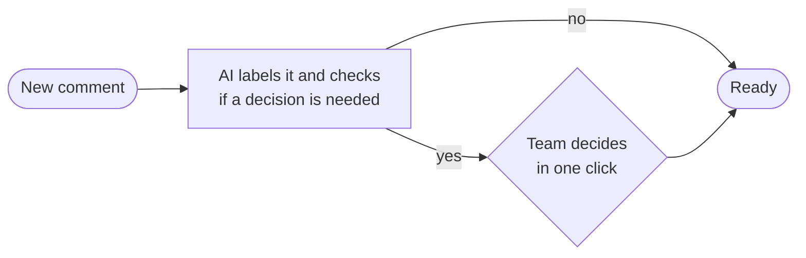
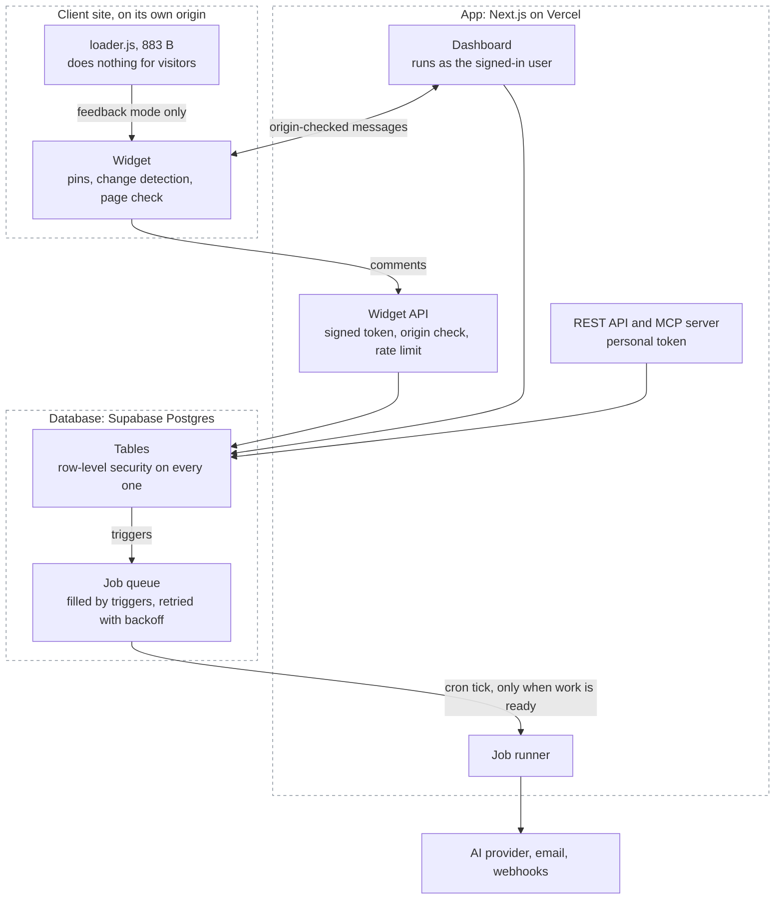
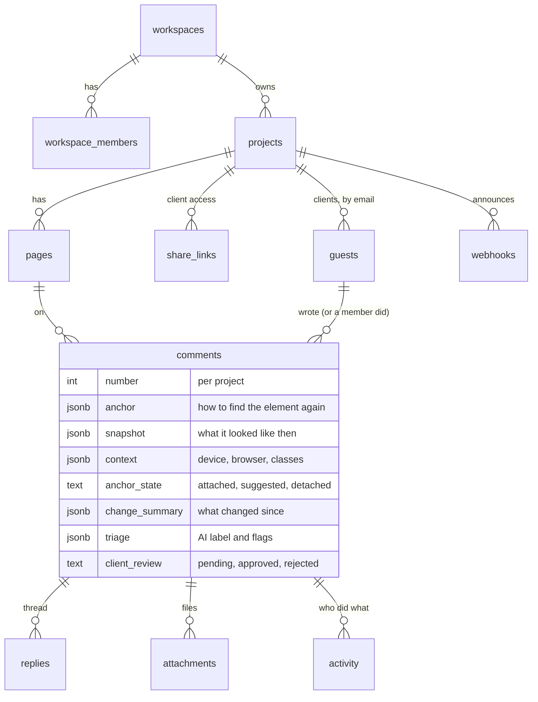

<div align="center">

# Basenine Feedback

**Visual feedback for client websites.**<br/>
The tool does the bookkeeping of a feedback round, so people only make the decisions.

[**Live app**](https://basenine-feedback.vercel.app) &nbsp;·&nbsp; [**Demo client site**](https://basefeed-demo.vercel.app) &nbsp;·&nbsp; [**Figma → Webflow assessment**](docs/figma-to-webflow.md)

[](https://github.com/n-3-0-l-d-3-v/basefeed/actions/workflows/ci.yml)

</div>

A client clicks any element on the real site and types a comment. It arrives pinned to that element,
with a screenshot, the Webflow classes, the device and the browser already attached. From there the
tool labels it, flags what needs a decision, notices when it has been fixed, and asks the client to
confirm, without anyone chasing anyone.

| Start here | How it works | Use it |
|---|---|---|
| [Why it exists](#why-it-exists)<br/>[What it does](#what-it-does)<br/>[Guarantees](#guarantees-measured-not-claimed)<br/>[Known limits](#known-limits) | [Architecture](#architecture)<br/>[Security](#security)<br/>[Integrations](#integrations)<br/>[Figma → Webflow](#figma--webflow-proof-of-concept) | [Run locally](#run-locally)<br/>[Install on a Webflow site](#install-on-a-webflow-site)<br/>[Tests](#tests)<br/>[Deploy](#deploy) |

---

## Why it exists

It is a rebuild of an existing internal tool ("Feedback 2.0"). Three of that tool's problems were
structural, so they were fixed by changing the design rather than patching:

| Problem in 2.0 | Root cause | What this does instead |
|---|---|---|
| Sites behind Cloudflare load blank | The server fetches the site through a proxy and gets the bot-check page | One line of script on the real site. Nothing is proxied, so nothing is blocked. Works on `*.webflow.io` staging too |
| Comments drift onto the wrong element after edits or on mobile | Pins stored as "element number N" plus page-level x/y percentages | Multi-signal anchoring (content, structure, surrounding text, siblings). It finds the same element or says it cannot. It never guesses |
| The previewed site runs with the app's own permissions | Proxied HTML is served from the app's origin | Client sites stay on their own origin. The dashboard and the widget talk only through origin-checked messages |

Everything else is automation layered on top.

## What it does

A feedback round has three stages. In the diagrams, the tool does every rectangular step by itself;
the diamonds are the only places a person decides.

### 1. Capture


- **Auto-context.** Every comment carries a screenshot of the area, the element's selector and Webflow classes, breakpoint, viewport, browser and OS. Nobody asks "which page, on what device?".
- **No account for clients.** A share link asks for a name and an email. Links are scoped to one site and revocable.
- **Attachments** (choose or paste) from the site widget and the dashboard, **Loom** links played inline, comments on uploaded **design images**.

### 2. Sort



- **AI triage that stays quiet.** A clear comment gets a short title and a category, nothing more. It speaks up only for: a comment too vague to act on (one click sends the clarifying question to the author), a duplicate of an older comment, a priority that is clearly wrong, and requests that are new work rather than a tweak. When the author dictates wording ("should say Book a demo") the exact replacement is extracted, ready to paste.
- **Page check.** One click inspects the live page for dead links, missing alt text, empty or out-of-order headings, duplicate IDs, placeholder text, broken images, horizontal overflow and low contrast, and files each finding as a comment pinned to the element. Plain DOM inspection: no AI, same page in, same findings out.

### 3. Close


- **Change detection.** When a commented element changes ("font-size 56px → 48px"), the comment is flagged as likely fixed. When the element is edited beyond recognition or removed, the comment says so, and a team member can re-pin it.
- **Client sign-off.** Resolving a client's comment emails them a link that opens the page on that comment, signed in, with *Looks good* / *Not yet*. "Not yet" reopens it with their note.
- **Impact.** Each project counts what the tool handled: context captured, comments sorted and flagged, fixes noticed, sign-offs, time to resolve. Counted from the data, never estimated.

### Around it

- **Work surfaces:** Canvas (the live site at real device widths), Board (drag between Open / In progress / Resolved), Ctrl+K search, email notifications, team invites.
- **Connections:** outgoing webhooks (Slack, n8n, Zapier), a REST API and an MCP server for coding agents. See [Integrations](#integrations).

## Architecture

### System

Three parts: the widget on the client's site, the app, and the database.



The dashboard also receives live updates from the database (Supabase Realtime), and files are kept in private storage buckets.

| Package | What it is |
|---|---|
| [`packages/anchor`](packages/anchor) | The anchoring engine and change detection. Pure TypeScript, no dependencies |
| [`packages/widget`](packages/widget) | The embed: a loader that decides whether to do anything, and the app (Preact, Shadow DOM) that loads only in feedback mode. Size-budgeted in the build |
| [`packages/shared`](packages/shared) | Zod contracts shared by widget and server; generated database types |
| [`packages/compiler`](packages/compiler) | Proof of concept for the Figma → Webflow build system |
| [`apps/web`](apps/web) | Dashboard, widget API, REST API, MCP server, job runner |
| [`supabase/`](supabase) | Schema, row-level security, triggers, job queue, pgTAP tests |
| [`e2e/site`](e2e/site) | A stand-in client site on its own origin, used by the tests and the demo |

### A comment, end to end

```mermaid
sequenceDiagram
  participant C as Client's browser (widget)
  participant A as Widget API
  participant P as Postgres
  participant J as Job runner
  participant X as AI provider
  participant T as Team dashboard

  C->>C: capture anchor, snapshot, context, screenshot
  C->>A: POST /api/widget/comments (token scoped to person, project, origin)
  A->>A: verify token, origin, membership or share link, rate limit
  A->>P: insert comment
  P->>P: triggers: number it, log activity, queue notification and webhooks
  A-->>C: 201 (pin appears)
  A->>J: drain queue after the response is sent
  J->>X: triage (structured output)
  X-->>J: label + flags
  J->>P: store; "ready" only if a person must decide
  P-->>T: Realtime: comment appears, already labelled
```

### Principles

- **AI for intent, code for execution.** AI labels a comment and flags what needs a person. Anything a client would notice (a question sent to them, a changed priority, closing a duplicate) happens only on a human's click. Anchoring, change detection, the page check, permissions and logging are deterministic code.
- **Never silently wrong.** An uncertain pin is shown as "element changed" or "removed"; it is not moved to a guess.
- **The database enforces isolation.** Row-level security on every table; the dashboard queries as the signed-in user, so an application bug cannot leak another workspace's data. Privileged paths (widget, API tokens) use the service role and scope every query to what the caller can reach; pgTAP tests assert it.
- **Nothing important depends on a code path remembering.** Numbering, the activity log, notifications, webhooks and the client sign-off state are database triggers.
- **Degrade, don't fail.** If the AI provider is down, out of quota or not configured, comments work exactly the same. Background work retries with backoff; a client-side upload failure never costs the client their comment.

### Data model



Also: `jobs` (the queue), `rate_limits`, `api_tokens` (stored as SHA-256 hashes), `workspace_invites`, `notification_prefs`, `profiles`.

### Background work

One Postgres table is the queue for AI triage, email and webhooks. Workers claim with `FOR UPDATE SKIP LOCKED`; failures retry up to five times with exponential backoff and jitter; a job stuck for five minutes is reclaimed. The app drains the queue right after each write. For retries, `pg_cron` ticks every minute and calls the app through `pg_net` only when a job is ready, so an idle project makes no requests. (Vercel's free plan allows only daily crons; this needs none.)

### Security

| Surface | How it is protected |
|---|---|
| Dashboard | Supabase Auth session; every query runs under row-level security |
| Widget API | JWT (HS256, 12 h) scoped to one person, one project and one origin; re-checked against the database on every request, so removing a member or switching off a share link takes effect immediately; per-person rate limit |
| Client email links | The same token, 7 days, valid only while the project still has an active share link |
| REST API and MCP | Personal tokens (`bnf_…`), stored only as a hash, revocable; every query scoped to the workspaces the owner belongs to today; per-token rate limit |
| Webhooks | HTTPS only; loopback, link-local and private addresses refused; redirects not followed; body signed with HMAC-SHA256 |
| Client sites | Stay on their own origin; the dashboard exchanges only origin-checked messages with the widget; nothing may frame the dashboard |
| Files | Private buckets, short-lived signed URLs, type and size limits enforced by storage |

## Guarantees (measured, not claimed)

Property-based tests generate thousands of random pages full of duplicates ("Learn more" ×3, shared
classes, repeated images), pin a comment, apply random edits (insert, delete, wrap, move, rename
classes, edit text, duplicate, delete the target) and check where the pin ended up.

- **A comment is only ever attached to the element it was made on, or to an exact duplicate the page gives no way to tell apart.** 3,000 random edit sequences per CI run. When this first ran in CI it found four ways a new wrapper or an empty twin could be mistaken for the original; each is fixed and pinned as its own regression test, and about 34,000 further sequences found nothing.
- Through ordinary edits elsewhere on the page:
  - distinctive content (headings, paragraphs, images): **about 91% stay attached automatically**, 99.9% attached or correctly suggested
  - repeated elements: 64% attached automatically, 98.4% attached or correctly suggested. Repeated elements inside a distinctive container (the usual card grid) are found through that container.
- Everything not attached automatically is shown as "element changed" or "removed" for a person to check.

The random pages are deliberately harsher than real sites: a tiny vocabulary with many exact duplicates.

**Not yet measured:** behaviour on a production Webflow site, and time saved on a real project. Both need a real client round.

## Integrations

### Webhooks (Slack, n8n, Zapier, Make)

Settings → Webhooks. Paste a URL, choose events, send a test.

Events: `comment.created`, `comment.status`, `reply.created`, `triage.flagged`, `client.approved`, `client.rejected`.

```json
{
  "event": "client.rejected",
  "at": "2026-10-04T09:12:44.120Z",
  "project": { "id": "…", "name": "Acme Logistics" },
  "actor": "Priya Raman",
  "comment": {
    "number": 12, "title": "Increase hero heading size on mobile", "status": "open", "priority": "high",
    "fromClient": true, "page": "https://acme.com/", "element": "h1.heading-style-h1",
    "url": "https://your-app/p/…?c=…"
  },
  "text": "Priya Raman says #12 on Acme Logistics isn't right yet: \"Increase hero heading size on mobile\"\nhttps://your-app/p/…"
}
```

- `text` is a complete sentence, which is all a Slack or Discord incoming webhook needs: paste the Slack URL and it works with no middle step.
- In **n8n**, add a *Webhook* trigger node, paste its URL here, and branch on `event`.
- Verify the sender: `X-Basenine-Signature` is `sha256=` + HMAC-SHA256 of the raw body with the webhook's signing secret.

```js
const expected = "sha256=" + crypto.createHmac("sha256", SECRET).update(rawBody).digest("hex");
const ok = crypto.timingSafeEqual(Buffer.from(expected), Buffer.from(req.headers["x-basenine-signature"]));
```

Deliveries go through the job queue: retried with backoff, last result shown in Settings. Page-check findings are not announced one by one.

### MCP server (Claude Code, Cursor, any MCP client)

```bash
claude mcp add --transport http basenine-feedback https://YOUR-APP/api/mcp --header "Authorization: Bearer bnf_…"
```

Tools: `list_feedback`, `get_feedback` (selector, Webflow classes, the request, the AI task, changes since, the thread), `reply`, `set_status`. Stateless Streamable HTTP. Tokens come from Account → API tokens.

### REST API

| Request | What it does |
|---|---|
| `GET /api/v1/feedback?status=unresolved&project=…&limit=…` | List |
| `GET /api/v1/feedback/:id` | One comment, with the same hand-off text as "Copy for AI agent" |
| `PATCH /api/v1/feedback/:id` `{"status"}` | Change status |
| `POST /api/v1/feedback/:id/replies` `{"body"}` | Reply |

REST and MCP share one service layer. Changes are logged under the token owner's name, and replies notify the people involved.

## Figma → Webflow proof of concept

[`packages/compiler`](packages/compiler) is a working core for a separate brief: converting approved Figma pages into native Webflow builds. Figma nodes → semantic description of each section (with a confidence score) → a rules engine that maps measurements to Client-First classes and tokens → a validated build plan that reuses what the site already has, is idempotent, and produces deltas.

```bash
pnpm --filter @bn/compiler demo
```

It runs on a fixture in the Figma REST API's format. It has not been run against a real Figma file or a real Webflow site. The feasibility assessment, architecture, risks and next step are in [docs/figma-to-webflow.md](docs/figma-to-webflow.md).

## Run locally

Requires Node 22, pnpm and Docker.

```bash
pnpm install
pnpm db:start                      # local Supabase (Docker)
pnpm db:reset                      # schema + demo seed (login is in supabase/seed.sql)
pnpm --filter @bn/widget build
pnpm --filter web dev              # http://localhost:3000
node e2e/site/serve.mjs            # demo client site on http://localhost:4000
```

Copy `apps/web/.env.example` to `apps/web/.env.local` and fill it from `supabase status`. AI triage is optional: `AI_PROVIDER=gemini` + `GEMINI_API_KEY` (a free key works), or `AI_PROVIDER=anthropic` + `ANTHROPIC_API_KEY`.

### Install on a Webflow site

Site settings → Custom code → Footer code:

```html
<script src="https://YOUR-APP/widget/loader.js" data-project="pk_…" defer></script>
```

Visitors are unaffected: the 883-byte loader reads two flags and exits. Feedback mode turns on from the dashboard, a client share link, or `?bn_feedback=1`.

## Tests

132 automated tests, plus type checks and lint, on every push.

| Suite | Count | Command | What it covers |
|---|---|---|---|
| Anchoring | 25 | `pnpm --filter @bn/anchor test` | Unit and property tests for the "never the wrong element" guarantee and change detection |
| Database | 55 | `pnpm db:test` | pgTAP: isolation between workspaces, forged authors, protected columns, the job ticker, client sign-off, webhook queueing |
| End to end | 17 | `pnpm --filter web exec playwright test` | The real stack on two origins: commenting, device widths, edits to the page, re-pinning, the page check, attachments, share links, sign-off by emailed link, invites, REST and MCP, webhooks, API security |
| Web | 12 | `pnpm --filter web test` | Triage rules, impact counts, webhook URL safety |
| Widget | 9 | `pnpm --filter @bn/widget test` | Page-check rules |
| Compiler | 14 | `pnpm --filter @bn/compiler test` | Reuse before creation, idempotency, deltas, naming validation, 300 random pages per run |

In CI the end-to-end suite runs against the production build.

## Deploy

Supabase (database, auth, storage, realtime) and Vercel (the app), both in the same region.

1. `npx supabase link` then `npx supabase db push`.
2. Vercel project with root directory `apps/web`; environment variables as in `.env.example`.
3. In Supabase Auth, set the Site URL to the app's address.
4. Once, in the SQL editor, so the database can trigger job retries:
   ```sql
   select vault.create_secret('https://YOUR-APP', 'app_url');
   select vault.create_secret('<CRON_SECRET>', 'cron_secret');
   ```

The demo client site deploys from `e2e/site` as its own Vercel project (set `APP_URL`); `supabase/demo/` holds realistic demo data.

## Known limits

- Content inside cross-origin iframes or closed shadow roots on the client site cannot be pinned.
- Screenshots are rendered from the DOM in the browser; cross-origin images without CORS headers may appear blank in them.
- Sites that forbid framing (CSP `frame-ancestors`) cannot be shown inside the Canvas; feedback mode in a new tab works the same.
- Change detection runs when a team member opens the page; there is no scheduled re-check yet.
- One email per event; there is no digest.
- Widget attachments are limited to 4 MB (10 MB from the dashboard).
- Email confirmation on sign-up is not wired up; the demo deployment has it switched off.
