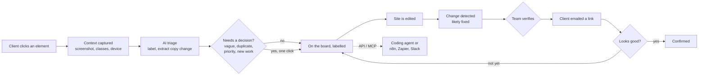

# Basenine Feedback

Visual feedback for client websites. Clients and the team click any element on the real site and
leave a comment; it lands pinned to that exact element with a screenshot, the Webflow classes, the
device and the browser attached. AI turns vague comments into clear tasks, and the tool notices by
itself when a commented element has changed, so "is this fixed?" stops being a manual check.

## What's different from Feedback 2.0

| Problem in 2.0 | Root cause | What this does instead |
|---|---|---|
| Sites behind Cloudflare (basenine.co itself) load blank | Server-side proxy fetches the site and gets the bot-check page | A one-line embed script runs on the real site. No proxy, so nothing to block. Works on `*.webflow.io` staging too |
| Comments drift onto the wrong element after edits or on mobile | Pins stored as "element #N in page order" plus page-level x/y % | Multi-signal anchoring (content, structure, surrounding text, parent). It either finds the same element or says it can't, and never guesses (see Guarantees) |
| Previewed site runs with the app's own permissions | Proxied HTML served from the app's origin with `allow-scripts allow-same-origin` | Client sites stay on their own origin; dashboard ↔ widget talk only through origin-checked messages |
| Clients need an account | — | Share links: name + email only, revocable, tokens scoped to one site |
| Team has to explain, triage and re-check every comment | — | Auto-captured context, AI triage that only flags what needs a person, automatic "changed since this comment" detection |

## Architecture

```
client site (any origin)                         app (Next.js 16)                    Postgres (Supabase)
┌──────────────────────────────┐   CORS + token  ┌───────────────────────────┐     ┌─────────────────────┐
│ loader.js  (883 B, dormant)  │ ──────────────▶ │ /api/widget/*             │ ──▶ │ RLS on every table  │
│   └─ app.js (Shadow DOM UI)  │                 │   verify token, origin,   │     │ triggers: numbering,│
│        anchoring engine      │ ◀── postMessage │   membership, rate limit  │     │  activity log       │
└──────────────────────────────┘   (origin-      │ dashboard (as the user,   │ ──▶ │ job queue (SKIP     │
           ▲ framed by                checked)   │   RLS-enforced)           │     │  LOCKED, backoff)   │
           └──────────────────────── Canvas ◀─── │ triage worker ─▶ AI       │     │ realtime → dashboard│
                                                 └───────────────────────────┘     └─────────────────────┘
```

- **`packages/anchor`**: the anchoring engine (pure TypeScript, no dependencies) plus change detection.
- **`packages/widget`**: the embed. The loader decides whether to do anything; the app (Preact, Shadow DOM, mounted outside `<body>`) loads only in feedback mode.
- **`packages/shared`**: Zod contracts shared by widget and server, and generated database types.
- **`apps/web`**: dashboard (Canvas, Board, Settings), widget API, share links, AI triage, job runner.
- **`packages/compiler`**: proof of concept for the Figma → Webflow build system: Figma nodes → semantic IR → Basenine rules engine → validated, idempotent build spec. See [docs/figma-to-webflow.md](docs/figma-to-webflow.md).
- **`supabase/`**: schema, row-level security, triggers, job queue and rate limiting in SQL, plus pgTAP tests.

### Principles (same as the Figma → Webflow brief)

- **AI for intent, code for execution.** AI labels each comment (a scannable title and a category) and flags what needs a person; anything a client would notice (a question to them, a changed priority, closing a duplicate) happens only on a human's click. Anchoring, change detection, permissions and logging are deterministic code.
- **Never silently wrong.** Uncertain anchors are shown as "element changed" or "removed" instead of being moved to a guess.
- **The database enforces isolation.** Row-level security on every table; the dashboard queries as the signed-in user.

## Guarantees (measured, not claimed)

Property-based tests generate thousands of random pages full of duplicates ("Learn more" ×3, shared
classes, repeated images), pin a comment, apply random edits (insert, delete, wrap, move, rename
classes, edit text, duplicate, delete the target) and check the result.

- **A comment is only ever attached to the element it was made on, or to an exact duplicate of it that the page gives no way to tell apart.** It never lands on an element with different content. 3,000 random edit sequences per run (5,000 in the release check); a deliberately weakened rule is caught within ~50.
- Through ordinary edits elsewhere on the page:
  - distinctive content (headings, paragraphs, images): **91% stay auto-attached**, 99.9% attached or correctly suggested
  - repeated elements ("Learn more" ×3): 64% auto-attached, 98.4% attached or correctly suggested. Repeated elements inside a distinctive container (the usual card grid) are found through that container, so adding or removing other cards keeps them attached (covered end-to-end).
- Everything not auto-attached is shown as "element changed" or "removed" for a human to check, never silently moved.

The random pages are deliberately harsher than real sites (a tiny vocabulary with many exact duplicates).

Exact duplicates in identical positions are genuinely indistinguishable, and the test states that explicitly rather than hiding it.

## Automation

One feedback round as a pipeline. Every arrow used to be a person; the two diamonds are the only
places a person still decides.



1. **Auto-context** on every comment: screenshot of the area (pin and outline drawn in), selector, Webflow classes, breakpoint, viewport, browser, OS.
2. **AI triage** (Claude or Gemini, structured output, same prompt and schema) that stays quiet unless it has something to add. A clear comment is labelled and left alone. It speaks up only for: a comment too vague to act on (one click sends the clarifying question to the author), a duplicate of an older comment (one click closes it into that thread), a priority that is clearly wrong ("button does nothing" filed as low), and requests that are new work rather than a tweak (scope and timeline). When the author dictates wording ("should say Book a demo", "$24 not $19") the exact replacement is extracted, ready to paste. It runs in a retrying background job; if the provider is down or not configured, comments work exactly the same.
3. **"Changed since this comment"**: when a team member views a page, the widget compares each commented element with its snapshot (text, image, 20 tracked styles, size) at the same breakpoint and flags likely fixes: "font-size 16px → 20px. Verify & resolve".
4. **Client sign-off**: resolving a client's comment emails them a link that opens the page on that comment, signed in, with Looks good / Not yet. "Not yet" reopens it with their note and tells the team.
5. **Impact**: each project counts what the tool handled (context captured, comments sorted and flagged, fixes noticed, client confirmations, time to resolve). Counted from the data, never estimated.
6. **Hand-off to coding agents**: "Copy for AI agent" exports markdown with selector, classes, DOM path, request, task and changes.

## API and MCP (for coding agents)

Personal tokens (Account → API tokens, stored only as a SHA-256 hash, revocable) give agents the
same access their owner has, scoped to the workspaces they belong to today.

- **MCP** (Streamable HTTP, stateless): `claude mcp add --transport http basenine-feedback https://YOUR-APP/api/mcp --header "Authorization: Bearer bnf_…"`.
  Tools: `list_feedback`, `get_feedback` (selector, Webflow classes, request, AI task, changes since, thread), `reply`, `set_status`.
- **REST v1**: `GET /api/v1/feedback?status=unresolved&project=…`, `GET /api/v1/feedback/:id`,
  `PATCH /api/v1/feedback/:id {"status"}`, `POST /api/v1/feedback/:id/replies {"body"}`.

Both run through one service layer; changes are logged under the token owner's name, and replies notify the team.

## Run locally

Requires Node 22, pnpm, Docker.

```bash
pnpm install
pnpm db:start          # local Supabase (Docker)
pnpm db:reset          # schema + demo seed (login is in supabase/seed.sql)
pnpm --filter @bn/widget build
pnpm --filter web dev  # http://localhost:3000
node e2e/site/serve.mjs  # demo client site on http://localhost:4000
```

`apps/web/.env.local` needs `NEXT_PUBLIC_SUPABASE_URL`, `NEXT_PUBLIC_SUPABASE_ANON_KEY`,
`SUPABASE_SERVICE_ROLE_KEY` (from `supabase status`), `APP_URL`, `WIDGET_TOKEN_SECRET` (32+ random
chars), `CRON_SECRET`, and optionally `AI_PROVIDER=anthropic` + `ANTHROPIC_API_KEY` or
`AI_PROVIDER=gemini` + `GEMINI_API_KEY` (free key from aistudio.google.com).

## Tests

```bash
pnpm --filter @bn/anchor test        # unit + property tests for anchoring and change detection
pnpm db:test                         # pgTAP: isolation between workspaces, forged authors, protected columns
pnpm --filter web exec playwright test  # end-to-end on the real stack, two origins
```

## Install on a Webflow site

Site settings → Custom code → Footer code:

```html
<script src="https://YOUR-APP/widget/loader.js" data-project="pk_…" defer></script>
```

Visitors are unaffected: the loader reads two flags and exits. Feedback mode turns on from the
dashboard, a client share link, or `?bn_feedback=1`.

## Known limits

- Content inside cross-origin iframes or closed shadow roots on the client site can't be pinned.
- Screenshots are rendered from the DOM in the browser; cross-origin images without CORS headers may appear blank in them.
- Sites that forbid framing (CSP `frame-ancestors`) can't be shown inside the dashboard Canvas; feedback mode in a new tab works the same.
